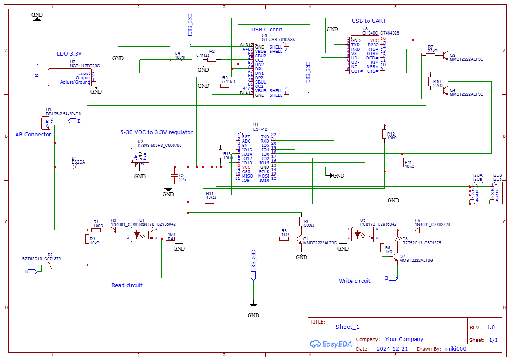

# ESPHome Toshiba_AB AC Component

ESPHome component to integrate with Toshiba Air Conditioners via AB line protocol


This project implements functions to decode Toshiba AB protocol from indoor units to wired controllers and provides a hardware design to communicate.

In particular, this project has been tested with remote control unit RBC-AMT32E and RBC-AMT54E and central unit RAV-SM1103DT-A but should work with other models using the AB protocol.


Requires reader & writer circuit to interface with the AB line, connected to the remote AB ports. 
The circuit board was designed in easyEDA and all necessary files are included here.

## To install, add or modify these sections in your esphome device yaml file

```yaml

logger:
  baud_rate: 0  #disable hardware UART log to use pins for UART communication with the AC unit 
  level: DEBUG

external_components:
  - source:
      type: git
      url: https://github.com/makusets/esphome-tcc-link

```

## Setup in yaml

```yaml
uart:
  tx_pin: GPIO15
  rx_pin: GPIO13
  baud_rate: 2400
  parity: EVEN

climate:
  - platform: toshiba_ab
    name: "Toshiba AC"
    id: toshiba_ac
    connected:
      name: "Toshiba AC Connected"
    failed_crcs:
      name: "Toshiba AC Failed CRCs"
    vent:
      name: "Toshiba AC Vent Switch"
    master: 0x01 # Master ID in Toshiba protocol, optional, default is 0x00, for some units needs to be set to 0x01 
```

## Optional section if you install a BME280 sensor


```yaml
# If installed, it will report the temperature to the AC master

i2c:
  sda: GPIO2
  scl: GPIO14
  scan: True


sensor:
  - platform: bme280_i2c
    temperature:
      name: "Indoor Temperature"
      id: bme_temp
      oversampling: 1x
    pressure:
      name: "Indoor Pressure"
      id: bme_pressure
      accuracy_decimals: 0
      oversampling: 1x
    humidity:
      name: "Indoor Humidity"
      id: bme_humidity
      accuracy_decimals: 0
      oversampling: 2x
    address: 0x76
    update_interval: 30s
    
```

# Hardware installation

You will need to build the esphome compatible hardware. Instruction below.

- Isolate the AC unit completely off (at the electrical distribution board ideally)
- Take out the cover of your remote controller
- Loose the screws of AB terminals. **WARNING**: The PCB assumes A is positive and B is negative. If this is not your case you can damage the PCB.
- Wire the remote A,B terminals to the pcb A,B ports


# Hardware design

This is the schematic of the board, it is powered by the AB line


